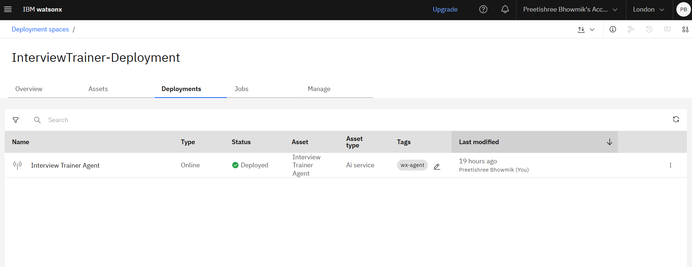
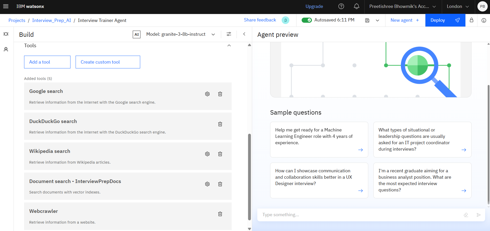

# Interview Trainer AI Agent

This repository contains an AI-powered Interview Trainer project developed for and within the **IBM Cloud watsonx.ai Studio** environment. The solution leverages IBM's advanced AI capabilities to simulate interview scenarios, provide intelligent feedback, and help users prepare effectively for real-world interviews.

---

## Table of Contents

- [Overview](#overview)
- [Demo & Visuals](#demo--visuals)
- [Repository Structure](#repository-structure)
- [Getting Started in IBM watsonx.ai Studio](#getting-started-in-ibm-watsonxai-studio)
- [How It Works](#how-it-works)
- [Customization](#customization)
- [References](#references)
- [License](#license)
- [Contact](#contact)

---

## Overview

The **Interview Trainer AI Agent** is a Jupyter Notebook-based solution designed to:

- Simulate realistic interview questions and dialogues using generative AI.
- Analyze user responses and provide structured, actionable feedback.
- Enable iterative practice and improvement—ideal for students, job seekers, or anyone looking to sharpen their interview skills.

The project is tailored and tested for the IBM Cloud watsonx.ai Studio platform, making use of its AI services, APIs, and managed notebook environment.

---

## Demo & Visuals

Key screenshots and workflow examples can be found in:
- [`output pics/`](output%20pics/) — Output and results samples
- 
- 
- 
- 
- 

A detailed project introduction is available in [IBM SkillsBuild AI Agent PPT.pdf](IBM%20SkillsBuild%20AI%20Agent%20PPT.pdf).

---

## Repository Structure

- **Interview-Agent code.ipynb**  
  Main Jupyter Notebook for building and running the Interview Trainer AI logic.

- **Interview-Agent-Deployment code.ipynb**  
  Steps and code to deploy the agent as a service or app in IBM watsonx.ai Studio.

- **IBM SkillsBuild certifications/**  
  Supporting files related to IBM SkillsBuild certifications.

- **api reference.png, deployed.png, setup and config.png, preview of deployed.jpeg, tools.png**  
  Visual documentation and workflow examples.

- **output pics/**  
  Directory containing result/output screenshots.

---

## Getting Started in IBM watsonx.ai Studio

1. **Clone this repository** into your IBM watsonx.ai Studio project.
2. **Open `Interview-Agent code.ipynb`** in the watsonx.ai JupyterLab interface.
3. **Follow the notebook cells**:
    - Install/verify dependencies (Python, Watson libraries, etc.)
    - Set up credentials and API access (see screenshots for setup details)
    - Run the interview simulation and feedback cells
4. **(Optional) Deploy** using `Interview-Agent-Deployment code.ipynb` to expose as a web app or API.

*Note: Screenshots and the [API reference](api%20reference.png) illustrate required configurations and workflow.*

---

## How It Works

- The notebook uses IBM Watsonx.ai's foundation models (LLMs) to generate tailored interview questions.
- User responses are analyzed by the AI for content, clarity, and relevance.
- Feedback is output as text and/or visual analytics within the notebook.
- The deployment notebook shows how to serve the agent as an interactive web/API app using IBM Cloud's managed infrastructure.

---

## Customization

- **Question Sets:** You can modify the prompts in the notebook to focus on specific industries or job roles.
- **Feedback Style:** Tune the feedback logic to emphasize different skills (communication, technical depth, etc.)
- **Integration:** The deployment notebook can be adapted to connect with external apps, Slack, or web frontends.

---

## References

- [IBM watsonx.ai Studio Documentation](https://cloud.ibm.com/docs/watsonx?topic=watsonx-welcome)
- [IBM SkillsBuild](https://skillsbuild.org/)
- [Project Slides: IBM SkillsBuild AI Agent PPT.pdf](IBM%20SkillsBuild%20AI%20Agent%20PPT.pdf)

---

## License

*No explicit license provided. Please contact the repository owner for reuse or contributions.*

---

## Contact

- **Author:** [preeti47g](https://github.com/preeti47g)
- For queries, open an issue in this repository.

---

*This project is built and optimized for IBM Cloud watsonx.ai Studio. For best results, run and deploy within the IBM cloud environment.*
